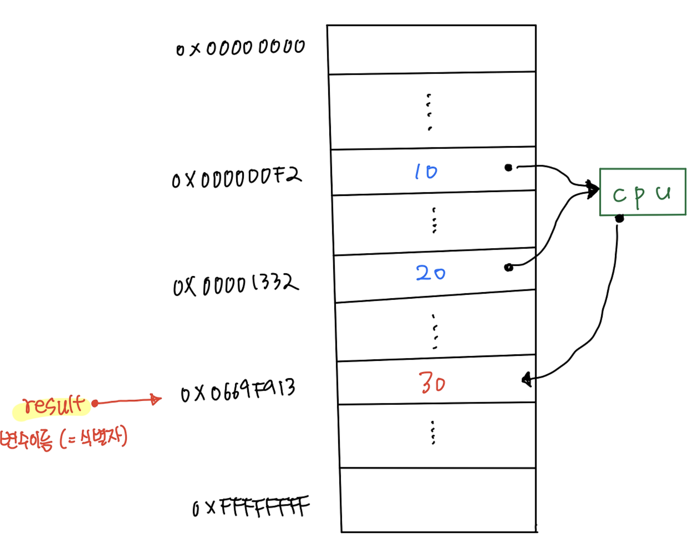
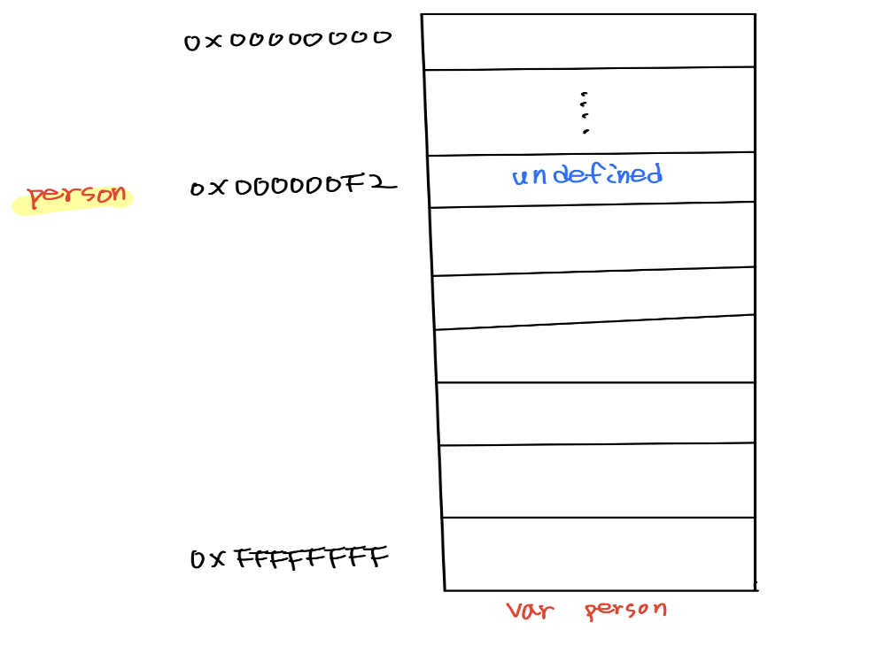
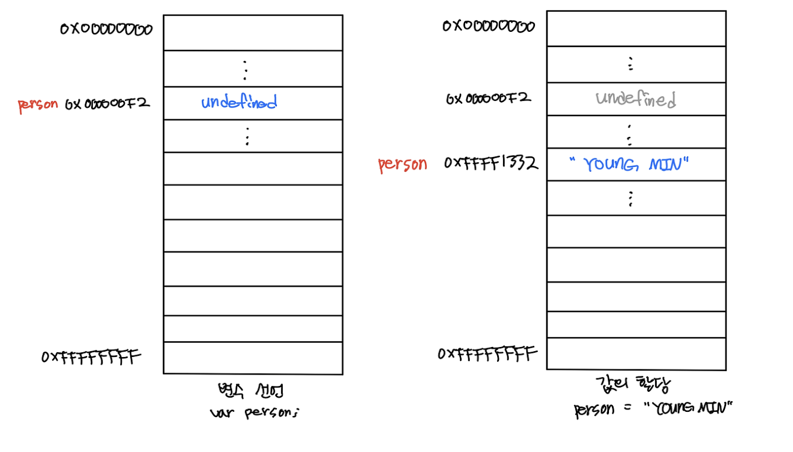
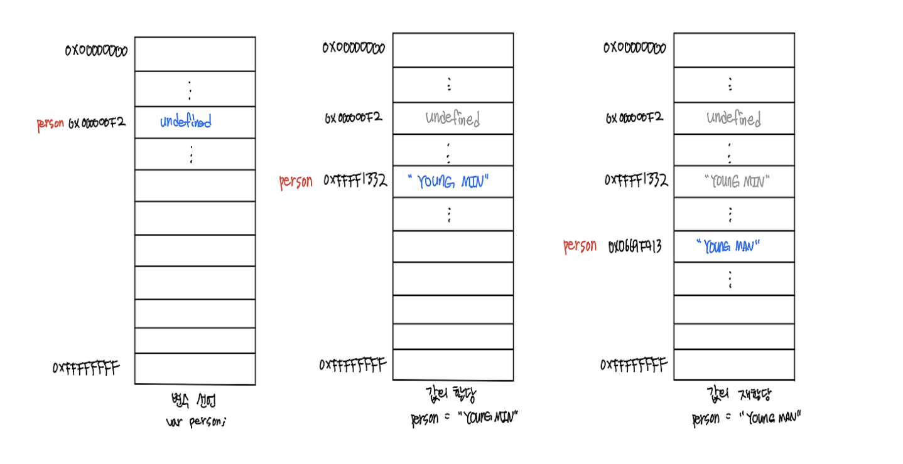

### 4.1 변수(Variable)

---

> 변수는 하나의 값을 저장하기 위해 확보한 `메모리 공간 자체`
> 또는 그 메모리 공간을 `식별하기 위해 붙인 이름`

```
var result = 10 + 20;
// 10 + 20은 30을 result라는 변수에 대입한 것
```

- 여기서 `result`는 메모리 공간에 저장된 값을 식별할 수 있는 고유한 이름 = `변수이름`
- 변수에 저장된 값(위 예제에서 30) = `변수값`
- 변수에 값을 저장하는 행위 = `할당(Assignment, 대입, 저장)`
- 변수에 저장된 값을 읽어 들이는 것 = `참조(Reference)`



### 4.2 식별자(Identifier)

---

> 식별자는 어떤 값을 구별해서 식별할 수 있는 고유한 이름을 말한다.


- `myNumber`라는 식별자는 값 23을 식별할 수 있어야 한다.
- 이를 위해 myNumber는 값 23이 저장되어 있는 `메모리 주소(0012CCGWH80)` 을 기억한다.
- 즉, 식별자는 `값이 저장되어 있는 메모리 주소와 매핑 관계`를 맺으며, `매핑 정보도 메모리에 저장`되어야 한다.

```
이와 같이 식별자는 값이 아니라 "메모리 주소를 기억하고 있다."

식별자로 값을 구별해서 식별한다는 것
= 식별자가 기억하고 있는 메모리 주소를 통해 메모리 공간에 저장된 값에 접근할 수 있다는 것을 의미함.
즉, 식별자는 "메모리 주소에 붙인 이름"
```

- 변수, 함수, 클래스 등의 이름은 모두 식별자다.
  - 변수이름 → 메모리 상에 존재하는 변수 값을 식별
  - 함수이름 → 메모리 상에 존재하는 함수(자바스크립트에서 함수도 값이다 !)를 식별
- 즉, 메모리 상에 존재하는 어떤 값을 식별할 수 있는 이름은 모두 식별자라고 한다.

### 4.3 변수 선언 (Variable Declaration)

---

> 변수 선언은 값을 저장하기 위한 `메모리 공간을 확보`하고 `변수 이름과 확보된 메모리 공간의 주소를 연결`해서 값을 저장할 수 있게 준비하는 과정

- 변수를 사용하려면 반드시 선언이 필요
- 변수 선언시에는 `var`, `let`, `const` 키워드를 사용

```
📚 var의 단점

블록 레벨 스코프(Block-Level Scope)를 지원하지 않고,
함수레벨 스코프(Functional-Level Scope)를 지원했다.
이로인해 의도치 않게 "전역 변수가 선언"되어 심각한 부작용이 발생할 수 있다.

이런 var 키워드의 단점을 보완하기 위해 등장한 것들이 ES6에 도입된 let과 const다.
이 둘은 블록 레벨 스코프를 지원한다.
```

**변수선언문**

```
var person;
```



- 변수 선언문은 `변수 이름을 등록`하고 `값을 저장할 메모리 공간을 확보`한다.
  - 변수 선언한 이후, 변수에 값은 아직 할당하지 않았다.
  - 따라서, 확보된 메모리 공간은 비어있을 것으로 생각할 수 있으나,
  - 확보된 메모리 공간에는 자바스크립트 엔진에 의해 `undefined` 값이 `암묵적으로 할당`되어 초기화 된다.

```
📚 undefined
자바스크립트에서 제공하는 "원시 타입 값(Primitive value)"이다.
```

**자바스크립트 엔진은 변수 선언을 2단계에 거쳐 수행한다.**

1. `선언 단계`: 이름을 등록해서 JS 엔진에 변수의 존재를 알린다
2. `초기화 단계`: 값을 저장하기 위한 메모리 공간 확보, 암묵적으로 undefined를 할당에 초기화

- var, let, const 키워드를 사용한 변수 선언은 `선언단계와 초기화 단계가 동시에 진행`된다.
- 예를 들어 `var person;`에 대해
  - 선언단계를 통해 변수이름은 `person`으로 등록하고
  - 초기화 단계를 통해 `person`변수에 암묵적으로 `undefined`를 할당해 초기화 한다.

```
💡 Garbage Value
초기화 단계를 거치지 않으면 확보된 메모리 공간에는
이전에 다른 애플리케이션이 사용했던 값이 남아 있을 수 있다.
이러한 값을 "쓰레기 값"이라고 한다.

자바스크립트에서 var 키워드는 암묵적으로 undefined 값으로 초기화를 수행하기 때문에
이러한 위험으로부터 안전하다.
```

```
📚 실행 컨텍스트 (Excute Context)
변수 이름을 비롯한 모든 식별자는 "실행 컨텍스트에 등록된다."

실행컨텍스트는 자바스크립트 엔진이 소스코드를 평가하고 실행하기 위해 필요한 환경으로 제공하고
코드의 실행 결과를 실제로 관리하는 영역

자바스크립트 엔진은 실행 컨텍스트를 통해 식별자와 스코프를 관리한다.
```

| 변수뿐만 아니라 모든 식별자(함수, 클래스 등)를 사용하려면 반드시 `선언이 필요`하다.

- 선언하지 않은 식별자에 접근하면 `ReferenceError(참조 에러)`가 발생함.
- 이는 식별자를 통해 값을 참조하려 했지만 자바스크립트 엔진이 등록된 식별자를 찾을 수 없을 때 발생하는 에러.

### 4.4 변수 선언의 실행 시점과 변수 호이스팅

---

> `변수 호이스팅`: 변수 선언문이 코드의 선두로 끌어 올려진 것 처럼 동작하는 자바스크립트 고유의 특징

```
console.log(score); // undefined

var score; // 변수 선언문
```

1. 변수 선언문 보다 변수를 참조하는 코드(console.log)가 앞에 있다.
2. JS는 인터프리터에 의해 한 줄씩 순차적으로 실행된다. 따라서 변수 참조시 참조 에러(ReferenceError)가 발생할 것 처럼 보인다.
3. 하지만 참조에러가 발생하지 않고 undefined가 출력된다.
4. 이유는 **변수 선언**이 _소스코드가 한 줄씩 순차적으로 실행되는 시점_, 즉 `Runtime이 아니라, 그 **이전 단계에서 먼저 실행**`되기 때문이다.

### 4.5 값의 할당

---

> `변수 선언`과 `값의 할당`(Assignment, 대입, 저장)은 실행시점이 다르다!

```
var score = 100; // 변수 선언과 값의 할당을 한 문장으로 표현 -> 내부적으로 실행시점은 각각 다름
```

- `변수 선언`: 런타임 이전에 실행
- `값의 할당`: 런타임에 실행

```
console.log(score); // undefined

var score; // 1. 변수 선언
score = 80; // 2. 값의 할당

console.log(score); // 80
```



score 변수에 값을 할당하면 score 변수의 값은 undefined에서 새롭게 할당한 숫자 값 80으로 변경(재할당)된다.

- 변수에 값을 할 당할 때는 이전 값 undefined가 저장되어 있던 메모리 공간을 지우고, 그 메모리 공간에 할당 값 80을 새로 저장하는 것이 아니라,
- 새로운 메모리 공간을 확보하고 그 곳에 할당 값 80을 저장한다.

### 4.6 값의 재할당

---

```
var score = 80; // 변수 선언 & 값의 할당
score = 90; // 값의 재할당
```

| var 키워드로 선언한 변수는 선언과 동시에 `undefined` 로 초기화되므로, 엄밀히 말하자면 변수에 처음 값을 할당하는 것도 사실은 재할당



값을 재할당할 때도 메모리 공간을 새로 확보하고 그 공간에 저장하고, 식별자와 연결한다.
이전의 값들은 불필요한 값이 되어 Garbage Collector에 의해 메모리에서 자동 해제된다.
(단 언제 해제될지는 예측 불가능)

```
🍧 const 키워드

+ 재할당은 변수에 저장된 값을 다른 값으로 변경하는 것 -> 그래서 "변수"
+ 만약, 값을 재할당할 수 없어서 변수에 저장된 값을 변경할 수 없다면 변수가 아닌 "상수(Constant)"라고 한다.

ES6에서 const 키워드 도입
+ 이 키워드로 선언한 변수는 재할당 금지, 즉 단 한번만 할당할 수 있는 변수 즉, "상수를 표현"
```

```
📚 가비지컬렉터

- 어떤 식별자도 참조하지 않는 메모리 공간을 검사하여 메모리 해제하는 기능
- JS는 가비지컬렉터를 내장하고 있는 매니지드언어 로서 Memory Leak을 방지한다.
```

```
📚언매니지드 언어와 매니지드 언어
메모리 관리 방식에 따라 분류

- UnManaged:
  - C언어, 개발자가 명시적으로 메모리를 할당하고 해제.
  - malloc()과 free()같은 저수준 (low-level) 메모리 제어 기능을 제공함.
- Managed:
  - Javascript
    - 메모리 관리 기능을 언어차원에서 담당. 개발자가 명시적으로 할당, 해제 불가.
    - 일정한 생산성 확보 but 성능 면에서 어느정도의 손실
```

### 4.7 식별자 네이밍 규칙

---

식별자(identifier): 어떤 값을 구별해서 식별해낼 수 있는 고유한 이름

- 식별자는 특수문자를 제외한 문자, 숫자, 언더스코어(\_), 달러 기호($)를 포함할 수 있음
- 단, 특수문자를 제외한 문자, 숫자, 언더스코어(\_), 달러 기호($)로 시작해야함. 숫자로 시작X
- 예약어는 식별자로 사용할 수 없음
- 예약어: 프로그래밍 언어에서 사용되고 있거나 사용될 예정인 단어.

- 자바스크립트에서는 일반적으로
  - `변수`나 `함수`에서는 `카멜 케이스`
    `var firstMan;`
  - `생성자 함수`, `클래스 이름`에는 `파스칼 케이스` `var FirstMan;`
